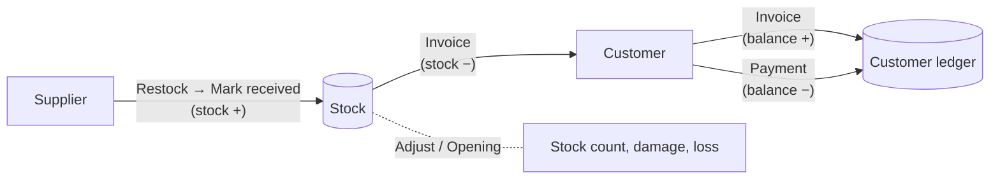

# MZTraders — User Guide

A complete guide to what the app does, what you see on each screen, and how to use it well.

---

## Contents

1. [What this app is for](#1-what-this-app-is-for)
2. [Benefits](#2-benefits)
3. [How the screen is organised](#3-how-the-screen-is-organised)
4. [Getting started: your first day](#4-getting-started-your-first-day)
5. [Screen-by-screen guide](#5-screen-by-screen-guide)
   - [Dashboard](#51-dashboard)
   - [Products](#52-products)
   - [Inventory](#53-inventory)
   - [Customers](#54-customers)
   - [Invoices](#55-invoices)
   - [Payments](#56-payments)
   - [Restocks](#57-restocks)
   - [Reports](#58-reports)
   - [CSV Tools](#59-csv-tools)
   - [Settings (business profile, backup and restore)](#510-settings)
6. [How everything connects](#6-how-everything-connects)
7. [Understanding the numbers](#7-understanding-the-numbers)
8. [Rules the app enforces](#8-rules-the-app-enforces)
9. [Using it effectively: daily, weekly and monthly routines](#9-using-it-effectively)
10. [Tips and best practices](#10-tips-and-best-practices)
11. [Known limitations in this build](#11-known-limitations-in-this-build)
12. [Where your data is stored](#12-where-your-data-is-stored)

---

## 1. What this app is for

**MZTraders** is a desktop app for small businesses that **buy stock from suppliers, sell it to customers, and often sell on credit.**

It brings four jobs together in one place:

| Job | What the app does |
|---|---|
| **Stock control** | Knows exactly how many of each product you have, and records every change. |
| **Selling** | Creates numbered invoices, checks stock and prices, and works out profit on every line. |
| **Customer accounts** | Keeps a ledger for each customer: what they bought, what they paid, and what they still owe. |
| **Buying** | Records purchase orders from suppliers ("restocks") and adds the stock when goods arrive. |

It also includes **reports**, **CSV import/export** (for Excel or your accountant), and **one-click backups**.

**Good fit for:** wholesalers and distributors, hardware and building-supply shops, grocery or FMCG wholesale, spare-parts sellers, and any shop that sells by the piece or carton and lets regular customers pay later.

**It runs entirely on your computer.** No internet connection, account, or subscription is needed.

---

## 2. Benefits

### 2.1 Your stock figure is always right, and you can prove it
Stock is never typed in directly. Every change is recorded as a **stock movement**: opening stock, restock received, sale, return, damage, correction. Each movement stores the quantity, the reason, the date, and the **balance after the change**.
- You can open **History** for any product and see exactly why the number is what it is.
- Missing stock is easy to trace. Every "−5" is linked to an invoice, an adjustment, or a reason someone typed.
- Staff can't quietly change a number without leaving a record.

### 2.2 You never sell below your price floor, and you see profit on every sale
Each product has a **base cost price**, a **minimum selling price** and a **normal selling price**.
- The invoice form **won't let anyone sell below the minimum price**, so discounts can't wipe out your margin.
- Every invoice line records the **cost at the time of sale**. If supplier prices change later, old profit figures stay correct.
- Each invoice shows its **profit**, and the Reports screen shows profit by product and by period.

### 2.3 You always know who owes you money
Every customer has a **ledger**: invoices add to their balance, payments reduce it.
- Each customer's screen shows **Balance**, **Outstanding**, **Total billed** and **Total paid**, plus a full transaction history with a **running balance**.
- The Dashboard shows the **total owed to you by all customers**.
- Invoices with a due date that isn't fully paid in time are **automatically marked Overdue**.
- Partial payments are handled correctly: the invoice shows **Partially paid** and the exact amount left.

### 2.4 Built-in protection against costly mistakes
The app blocks common errors before they happen. For example, it won't let you:
- sell more than you have in stock,
- take a payment larger than what the invoice still owes,
- delete a customer who has invoices or payments (you deactivate them instead),
- create an invoice for an inactive customer or an inactive product,
- take stock below zero with an adjustment,
- change a restock after the goods have been received.

A full list is in [section 8](#8-rules-the-app-enforces).

### 2.5 Faster buying decisions
- The Dashboard lists **low-stock and out-of-stock products** as soon as you open the app.
- Each product's **reorder level** tells the app when to warn you.
- The **Restocks** screen keeps every purchase order with its supplier, date, items, unit costs and status (Pending, Received or Cancelled).

### 2.6 Clear reports without spreadsheets
Seven report tabs cover any date range: **Sales, Profit & Loss, Inventory, Customers, Payments, Restocks, Stock movements**. Examples:
- Which products made the most profit this month?
- How much did we receive in cash vs bank transfer?
- What is our stock worth at cost right now?

Most reports can be **exported to CSV** in one click.

### 2.7 Private, offline, and free to run
- All data stays in one file on your computer. Nothing is uploaded anywhere.
- It works without internet, so an outage never stops you selling.
- There are no monthly fees and no limits on users, products or invoices.

### 2.8 Easy to move data in and out
- **Import** products, customers and restocks from a CSV file, so you don't retype an existing product list.
- **Export** invoices, restocks, sales, payments, stock movements, inventory and customers to CSV for Excel, Google Sheets or your accountant.

### 2.9 Safe backups you can trust
- **Create backup** saves your entire business into one `.db` file you can copy to a USB drive or cloud folder.
- **Restore** checks the backup before using it: it runs an integrity check and confirms every required table is present. It also asks for confirmation, so a damaged or wrong file can't overwrite your data.

### 2.10 Professional, consistent records
- Invoices are numbered automatically and in order (for example `INV-000001`, `INV-000002`, …) using your own prefix.
- Restocks are numbered automatically (`RS-000001`, …).
- Invoice lines keep the product name, SKU and price exactly as they were on the day of sale.

---

## 3. How the screen is organised

```
┌──────────────┬──────────────────────────────────────────────────┐
│ Sidebar      │  Header:  [← Back to …]   Page title              │
│              ├──────────────────────────────────────────────────┤
│ ▦ Dashboard  │  Toolbar: search box · filter buttons · actions  │
│ ≡ Invoices   │                                                  │
│ ◉ Customers  │  Main table / details                            │
│ ▤ Products   │                                                  │
│ ▣ Inventory  │  (Forms open as pop-up windows on top)           │
│ ↑ Restocks   │                                                  │
│ ◈ Payments   │                                                  │
│ ∑ Reports    │                                                  │
│ ⧉ CSV Tools  │                                                  │
│ ⌘ Settings   │                                                  │
└──────────────┴──────────────────────────────────────────────────┘
```

**Things that work the same everywhere:**

| Element | How it behaves |
|---|---|
| **Sidebar** | Click a section to open it. The current section is highlighted. |
| **Header** | Shows the page title. On a detail page (one customer, invoice or restock) a **← Back to …** button appears. |
| **Search box** | Filters the list as you type. |
| **Filter buttons** | For example *All / Active / Inactive* or *All / Sent / Paid…*. One is highlighted at a time. |
| **Clicking a row** | Opens that item's details. |
| **Pop-up forms** | "Add", "Edit", "New" and "Record" open a form on top. Close it with **✕**, **Cancel**, or by clicking outside it. |
| **Required fields** | Marked with **\***. Mistakes appear in red under the field. |
| **Delete buttons** | Need **two clicks**: click **Delete**, then click again (**Confirm**) within about 3 seconds. This prevents accidental deletes. |
| **Money** | Typed and shown in dollars with 2 decimals, for example `12.50`. |
| **Colours** | Green = good / paid / in stock. Orange = warning / low stock / owes money. Red = problem / out of stock / overdue / cancelled. |

---

## 4. Getting started: your first day

Follow these steps in order. They take 15–30 minutes for a small product list.

> ⚠️ **Step 1 has a known problem in this build.** On a brand-new installation the business profile doesn't exist yet, and the **Edit** button in Settings can't create it. Without a business profile, **invoices can't be created** (you'll see *"Business profile not configured"*). Ask your developer to fix this before going live; see [Known limitations](#11-known-limitations-in-this-build).

1. **Set up your business profile** — *Settings → Business profile → Edit.*
   Enter your business name, contact details, tax ID, default tax rate, currency, **invoice prefix** (e.g. `INV-`) and an invoice footer.

2. **Add your products** — *Products → + Add product*, or import a list with *CSV Tools* (section 5.9).
   For each product, set the **minimum selling price** and **reorder level**. They're what make the price protection and low-stock alerts work.

3. **Enter your opening stock** — *Inventory → find the product → Opening.*
   Type how many you have today. This is the starting point for all future stock changes.

4. **Add your customers** — *Customers → + Add customer*, or import them with *CSV Tools*.

5. **Create your first invoice** — *Invoices → + New invoice.*
   Stock goes down and the customer's balance goes up automatically.

6. **Record a payment** — open the invoice → **+ Record payment**.

7. **Make a backup** — *Settings → Create backup…*. Now you have a safe copy.

---

## 5. Screen-by-screen guide

### 5.1 Dashboard

The first screen you see: a live summary of your business today.

**What you see**

| Area | Meaning |
|---|---|
| **Revenue today** | Total of invoices dated today. |
| **Profit today** | Profit from today's invoices. |
| **Sales today** | Number of invoices dated today. |
| **Customer outstanding** | Total money all customers owe you. Shown in orange when above zero. |
| **Customers / Products** | How many you have. |
| **Low stock / Out of stock** | How many products need attention. |
| **Low stock alerts** | A table of products at or below their reorder level, lowest stock first. Shows *"All stock levels are healthy."* when there's nothing to worry about. |
| **Recent invoices** | The last 5 invoices, with total, outstanding amount, status and a **View** button. |
| **Recent payments** | The last 5 payments, with a **View all payments** button. |

**What you can do**
- Click **View** on an invoice to open it.
- Click **View all payments** to go to the Payments screen.
- Opening the Dashboard also **updates overdue invoices**: any unpaid invoice past its due date becomes *Overdue*.

---

### 5.2 Products

Your product catalogue: what you sell and at what price.

**What you see:** a table with **SKU, Name, Category, Selling price, Stock, Status**. Stock is orange when low and red when out.

**Toolbar**
- **Search** by name or SKU.
- **All / Active / Inactive** filter.
- **+ Add product**.

**Product details panel** — click a product row to open a panel on the right showing:
- a big **current stock** number and a badge: *In stock*, *Low stock* or *Out of stock*,
- category, unit, pieces per carton, base cost price, min selling price, selling price, reorder level, status, created and last-updated dates, and description.

It has three buttons:
- **Edit** — change the product.
- **Deactivate / Reactivate** — hide a product from new invoices and restocks without losing its history.
- **Delete** — two clicks. *See the warning below.*

**Add / Edit product form**

| Field | Notes |
|---|---|
| **Name \*** | Required. |
| **SKU \*** | Your unique product code. **It can't be changed after the product is created.** |
| Description | Optional. |
| Category | Choose from the list, or *Uncategorized*. |
| Unit | For example `piece`, `carton`, `kg`. |
| Pieces per carton | At least 1. |
| Reorder level | When stock reaches this number or less, the product counts as *Low stock*. Use 0 for no alert. |
| Base cost price ($) | What the product costs you. Used to calculate profit. |
| Min selling price ($) | The lowest price anyone can sell at. |
| Selling price ($) | The normal price. Pre-filled on invoices. **Can't be lower than the minimum price.** |

> ⚠️ **Deactivate rather than delete.** Deleting a product also deletes its stock history and **removes its lines from old invoices**. If you've ever sold a product, deactivate it instead.

---

### 5.3 Inventory

Where you check and correct stock levels.

**What you see:** **SKU, Name, In stock, Reorder level, Status** (*In stock / Low stock / Out of stock*) and **Actions**.

**Toolbar**
- **Search** by name or SKU.
- Filters: **All**, **Low stock (n)**, **Out of stock (n)**. The numbers update live.

**Actions on each product**

| Button | What it does |
|---|---|
| **Adjust** | Adds or removes stock for a reason. See below. |
| **History** | Shows every stock movement for this product: date, type, quantity (+ green / − red), balance after the change, and reason. |
| **Opening** | Sets the stock to an exact number. Use it once, when you start using the app, to record what's on your shelves. |

**Adjust stock form**

| Field | Options |
|---|---|
| Type | Damage, Theft, Loss, Correction, Return |
| Direction | **+ Add stock** or **− Remove stock** |
| Quantity | Whole number above 0 |
| Reason \* | Required, for example "stock count 12 June", "broken in transit" |
| Notes | Optional |

You can't remove more than you have. The form tells you *"Only N in stock"*.

> 💡 Use **Adjust** for losses and corrections only. For goods arriving from a supplier use **Restocks**, which also records what you paid.

---

### 5.4 Customers

Your customer list and each customer's account.

**What you see:** **Name** (with email underneath), **Phone / Contact**, **Balance**, **Outstanding**, **Status**, and **View** / **Edit** buttons.
- Balance is **orange** when the customer owes you and **green** when they have credit with you.
- Outstanding is **red** when above zero.
- The toolbar shows how many customers have an outstanding balance.

**Toolbar:** search by **name, phone or email**; **All / Active / Inactive** filter; **+ Add customer**.

**Add / Edit customer form**

| Field | Rules |
|---|---|
| Name \* | Required. Two customers can't have the same name. |
| Phone | 7–15 digits. Two customers can't share a phone number. |
| Email | Must look like an email address. |
| Address, Notes | Optional. |

**Customer details page** (click a customer)
- **Contact details**: phone, email, address, notes.
- **Four balance cards**:
  - **Balance**, with the word *owes us*, *credit on account* or *settled*,
  - **Outstanding** and the number of ledger entries,
  - **Total billed** (everything invoiced),
  - **Total paid** (everything received).
- **Buttons**: **Edit**, **Deactivate / Reactivate**, **Delete** (two clicks, and only for customers with no invoices, payments or ledger entries).
- **Ledger / Transaction history**, with **from/to date** filters:

| Column | Meaning |
|---|---|
| Date | Transaction date |
| Type | Invoice, Payment, Credit note or Adjustment |
| Reference | What created the entry, e.g. `invoice #12` |
| Description | e.g. *Invoice INV-000012*, *Payment received via cash* |
| Debit | Amount added to what they owe (red) |
| Credit | Amount paid or credited (green) |
| Running balance | What they owed after this line |

---

### 5.5 Invoices

Where you sell.

**What you see:** **Invoice #, Customer, Date, Due, Total, Paid, Outstanding, Status, View**.

**Toolbar**
- **Search** by invoice number or customer.
- Status filters: **All, Sent, Partial, Paid, Overdue, Cancelled**.
- **Export CSV** exports the invoices currently shown by the filter.
- **+ New invoice**.

**New invoice form**

1. **Customer \***: only active customers are listed, each with their current balance. After you choose one, their outstanding amount is shown.
2. **Date \***: today by default. **Due date** is optional; set it if you give credit terms.
3. **Tax rate (%)** and **Discount ($)**.
4. **Items**: click **+ Add item** for each product.
   - Choose the product. The list shows how many are in stock.
   - Enter the **quantity**.
   - The **price** fills in automatically from the product's selling price. You can change it, but not below the minimum.
   - A hint shows the *Min* price and *Cost*, and the line total is calculated live.
   - Remove a line with **✕**.
5. **Totals** update as you type: **Subtotal**, **Tax**, **Discount**, **Total** and **Estimated profit**.
6. Click **Save invoice**.

The form refuses to save if a quantity is more than the stock, a price is below the minimum, or no customer or items are chosen.

**What happens when you save an invoice** (automatically, all together):
- The invoice gets the next number, e.g. `INV-000007`.
- **Stock is reduced** for every product on it.
- The **customer's balance goes up** by the invoice total.
- The invoice starts with status **Sent**.

**Invoice details page**
- Header: invoice number, customer, date, due date, notes and a **status badge**.
- Items table: product, SKU, quantity, unit price and line total.
- Totals: subtotal, discount, tax, **total** and **profit**.
- **Payments** table: every payment against this invoice, each with a two-click **Delete**.

Buttons:

| Button | When it's available | What it does |
|---|---|---|
| **+ Record payment** | Not cancelled and something is still owed | Opens the payment form for this invoice |
| **Cancel invoice** | No payments yet, not cancelled | Asks for confirmation, then **puts the stock back** and **removes the charge** from the customer's account. The invoice stays, marked *Cancelled*. |
| **Delete invoice** | No payments yet | Asks for confirmation, then removes the invoice completely. The stock and customer charge are reversed unless it was already cancelled. |
| **Print** | Always | Prints the current screen. |

> 💡 **Invoice lines can't be edited after saving.** This protects your stock and account records. If you made a mistake, **cancel** the invoice and create a new one.

---

### 5.6 Payments

All money received from customers.

**What you see:** **Date, Customer, Invoice, Method, Amount, Reference** and a two-click **Delete**.
**Search** by customer, invoice number or payment method. **+ Record payment** opens the payment form.

**Record payment form**

| Field | Notes |
|---|---|
| Customer \* | Only active customers. |
| Invoice (optional) | Lists this customer's unpaid invoices with the amount owed on each. Choosing one **fills in the amount** automatically. Choose *"No invoice — generic payment"* for a payment on account. |
| Date \* | Payment date. |
| Method \* | Cash, Bank transfer, Card, Check, Other |
| Amount \* | Must be above 0. When an invoice is chosen, it **can't be more than the amount still owed**. |
| Reference | For example a cheque number or bank transaction ID. |
| Notes | Optional. |

**What happens when you save a payment**
- The **customer's balance goes down**.
- If linked to an invoice, the invoice's **Paid** and **Outstanding** figures update, and its status changes to **Partially paid** or **Paid**.
- **Deleting** a payment reverses all of this.

> 💡 **Link payments to invoices whenever you can.** A generic payment lowers the customer's overall balance, but their invoices stay unpaid, and may show as Overdue.

---

### 5.7 Restocks

Purchases from your suppliers.

**What you see:** **Reference** (e.g. `RS-000003`), **Supplier, Date, Items, Total cost, Status** (*Pending* in orange, *Received* in green, *Cancelled* in red).

**Toolbar:** search by reference or supplier; **All / Pending / Received / Cancelled**; **Export CSV**; **+ New restock**.

**New restock form**
- **Supplier name \***, **Date \***, **Notes**.
- **Items**: for each line choose the product, then enter the **quantity**, **unit** and **unit cost**. The line total and **total cost** are calculated live.
- Each product can appear **only once** per restock, and only active products can be restocked.

**Restock details page:** supplier, date, notes, the items table (product, SKU, unit, quantity, unit cost, line total) and the total cost.

| Status | Buttons available |
|---|---|
| **Pending** | **Edit**, **Mark received**, **Cancel restock**, **Delete** (two clicks) |
| **Received** | None. It's locked as a permanent record. |
| **Cancelled** | **Delete** (two clicks) |

**The typical restock workflow**
1. Create the restock when you **place the order**. It's *Pending*, and stock doesn't change yet.
2. When the goods **arrive**, open it and click **Mark received**. Stock increases for every item, recorded at the unit cost you entered.
3. If the order falls through, click **Cancel restock**.

> 💡 Receiving a restock doesn't change the product's *base cost price*. If your supplier's price changed, update the product too.

---

### 5.8 Reports

At the top: **report tabs**, **From / To dates** and **Export CSV**. Changing a date reloads the report.

| Tab | Summary cards | Table |
|---|---|---|
| **Sales** | Revenue, Cost of goods, Profit, Invoices, Customers | Each product sold: quantity, revenue, cost, profit |
| **Profit & Loss** | Revenue, Cost of goods, Gross profit, Expenses, Net profit, Net margin % | — |
| **Inventory** | Products, Stock value (at cost), Low stock count | Each active product: quantity, selling price, value at cost. *This is today's snapshot; dates don't apply.* |
| **Customers** | Customers, Purchases, Payments, Outstanding | Per customer: purchases and payments in the period, total ever purchased, outstanding |
| **Payments** | Total received, Number of payments, **breakdown by method** | Every payment in the period |
| **Restocks** | Total restock value, Received value, Orders, Received count | Every restock in the period |
| **Stock movements** | Inbound units, Inbound value, Outbound units | Every stock change: date, product, type, quantity, new quantity, reason |

**Export CSV** saves the current tab to a file you choose. It isn't available on Profit & Loss.

---

### 5.9 CSV Tools

Bring existing data into the app from a spreadsheet.

**Steps**
1. Choose **what you're importing**: *Products*, *Customers* or *Restocks*.
2. Choose the **delimiter** (comma, semicolon or tab) and whether the **first row is a header**.
3. Click **Choose CSV file…**.
4. Check the **preview**: the number of rows and columns, and the first 10 rows. **Column mapping** shows how your columns are matched.
5. Click **Import**. The button stays greyed out until the file contains all required columns.
6. Read the **result**: **Imported**, **Skipped**, **Duplicates**, and a list of problems with the **row number** and reason for each.

**Column names must match exactly** (letter case included). Put these names in the header row of your file:

| Importing | Required columns | Optional columns |
|---|---|---|
| **Products** | `sku`, `name` | `description`, `category`, `unit`, `piecesPerCarton`, `baseCostPrice`, `minSellingPrice`, `sellingPrice`, `reorderLevel` |
| **Customers** | `name` | `phone`, `email`, `address`, `notes` |
| **Restocks** | `supplierName`, `productSKU`, `quantity`, `unitCost` | `date` (YYYY-MM-DD), `unit`, `notes` |

**Good to know**
- **Products:** if the `category` doesn't exist yet, it's **created automatically**. A duplicate SKU, inside the file or already in the app, is skipped and reported.
- **Customers:** duplicate names or phone numbers are skipped and reported.
- **Restocks:** rows with the **same supplier and date are grouped into one restock**, created as *Pending*. Products are matched by SKU, and the date defaults to today if it's missing.
- **Prices:** enter prices the way you'd type them in the app, e.g. `12.50`. Leave out currency symbols and thousands separators: `$12.50` or `1,250.00` will be rejected, so write `12.50` and `1250.00`.

**Example products file**
```csv
sku,name,category,unit,piecesPerCarton,baseCostPrice,minSellingPrice,sellingPrice,reorderLevel
BOLT-M8,M8 Bolt,Hardware,piece,100,0.10,0.18,0.25,500
PAINT-5L,White Paint 5L,Paint,tin,4,12.00,15.00,18.50,10
```

**Where to export:** the **Invoices**, **Restocks** and **Reports** screens each have an **Export CSV** button. For a product list use *Reports → Inventory*, and for customers use *Reports → Customers*.

---

### 5.10 Settings

**Business profile.** Shows your business name, owner, phone, email, address, tax ID, default tax rate, currency, invoice prefix and invoice footer. Click **Edit** to change them.
- The **invoice prefix** is used for every new invoice number (e.g. `INV-` → `INV-000001`).
- *See the known problem in [section 11](#11-known-limitations-in-this-build) about creating the profile the first time.*

**Backup & restore**
- **Create backup…** — choose where to save. The suggested name is `MZTraders-backup-YYYY-MM-DD.db`. The file contains **all** your data. Afterwards you'll see the file name, time and size.
- **Restore from backup…** — choose a backup `.db` file. The app first **checks it**: it must be a valid database that passes an integrity check and contains all required tables. It then asks you to confirm, because **restoring replaces all current data and can't be undone.**

---

## 6. How everything connects



**What happens automatically when you…**

| You do this | Stock | Customer balance | Invoice |
|---|---|---|---|
| Set **opening stock** | Set to the number you enter | — | — |
| **Adjust** stock (+ or −) | Up or down | — | — |
| **Mark a restock received** | **Up** for every item | — | — |
| **Create an invoice** | **Down** for every item | **Up** (owes more) | New, status *Sent* |
| **Record a payment** on an invoice | — | **Down** | Paid ↑, Outstanding ↓, status *Partially paid* or *Paid* |
| Record a **generic payment** (no invoice) | — | **Down** | No change |
| **Delete a payment** | — | Back up | Paid and status recalculated |
| **Cancel an invoice** (no payments) | **Back up** (recorded as a return) | Charge removed | Status *Cancelled* |
| **Delete an invoice** (no payments) | Back up, unless already cancelled | Charge removed | Removed |
| An invoice passes its **due date** unpaid | — | — | Status becomes *Overdue* |

---

## 7. Understanding the numbers

### Stock status
| Status | Rule |
|---|---|
| **Out of stock** (red) | Current stock is 0 or less |
| **Low stock** (orange) | Reorder level is above 0 **and** stock is above 0 but at or below the reorder level |
| **In stock** (green) | Anything else |

### Invoice status
| Status | Meaning |
|---|---|
| **Sent** | Created, nothing paid yet |
| **Partially paid** | Some money received, some still owed |
| **Paid** | Nothing left to pay |
| **Overdue** | Past its due date with money still owed |
| **Cancelled** | Cancelled: stock returned and charge removed |

### Invoice totals
```
Subtotal = sum of (quantity × price) for every line
Tax      = (Subtotal − Discount) × Tax rate %
Total    = Subtotal − Discount + Tax
Profit   = Total − cost of the goods sold
```

### Customer balance
| Term | Meaning |
|---|---|
| **Debit** | Adds to what the customer owes (invoices) |
| **Credit** | Reduces what they owe (payments) |
| **Balance** | All debits − all credits. **Positive = they owe you. Negative = you owe them (credit on account).** |
| **Outstanding** | The balance when it's positive, otherwise 0 |
| **Running balance** | The balance after each ledger line, in date order |

---

## 8. Rules the app enforces

| Area | Rule |
|---|---|
| Products | Name and SKU are required. SKUs are unique and can't be changed after creation. Prices can't be negative. **Selling price ≥ minimum selling price.** Pieces per carton ≥ 1. |
| Categories | A category can't be deleted while products still belong to it. |
| Stock | Adjustments can't take stock below zero. The reason field is required. |
| Customers | Names and phone numbers must be unique. Phone numbers need 7–15 digits. Email must be valid. **Customers with any history can't be deleted**; deactivate them. |
| Invoices | Need a customer and at least one item. **Quantity can't exceed stock. Price can't go below the product's minimum.** Inactive customers and inactive products can't be invoiced. Tax is 0–100%. Items can't be edited after saving. An invoice with payments can't be cancelled or deleted. |
| Payments | The amount must be above 0 and **can't exceed what the invoice still owes**. Payments can't be recorded on cancelled invoices or for inactive customers. |
| Restocks | Supplier and at least one item are required. Each product appears only once. Only active products can be restocked. **Only pending restocks** can be edited, received or cancelled. Received restocks can't be deleted. |
| Backups | A restore file must pass an integrity check and contain every required table. |

---

## 9. Using it effectively

### Every day
1. **Open the Dashboard.** Check today's revenue and profit, the total owed to you, and the **Low stock alerts**.
2. **Create invoices** as you sell.
3. **Record payments** as money comes in, linked to the right invoice.
4. When deliveries arrive, open the pending restock and click **Mark received**.

### Every week
1. **Invoices → Overdue**: phone or message customers who are late.
2. **Inventory → Low stock / Out of stock**: create **Restocks** for what you need to order.
3. **Settings → Create backup…**: save the file somewhere other than this computer (USB drive or cloud folder).

### Every month
1. **Reports → Sales** for the month: see your best sellers and least profitable products.
2. **Reports → Profit & Loss**: check your gross profit and margin.
3. **Reports → Payments**: compare the breakdown by method with your bank statement.
4. **Reports → Customers**: review who owes the most.
5. **Stock count**: count your shelves, then use **Inventory → Adjust → Correction** for any difference, with a clear reason.
6. **Export CSVs** for your accountant.

---

## 10. Tips and best practices

1. **Always fill in the minimum selling price.** It's your automatic protection against over-discounting.
2. **Set a reorder level for every product you don't want to run out of.** The Dashboard only warns you about products that have one.
3. **Use Restocks for supplier deliveries**, not Adjust. Restocks record the supplier, date and cost, so your reports and stock value stay accurate.
4. **Deactivate instead of deleting** products and customers. Their history stays intact.
5. **Always write a clear reason** for stock adjustments. It's your audit trail when stock goes missing.
6. **Link every payment to an invoice** when you can, so invoice statuses stay accurate.
7. **Set due dates** on credit sales, so overdue invoices are flagged automatically.
8. **Use the Reference field** on payments for cheque numbers and bank transaction IDs. It makes reconciling your bank much easier.
9. **Don't fix a wrong invoice by editing stock.** Cancel it and create a new one; the app handles the stock and the customer's balance.
10. **Back up at least weekly, and keep one copy off this computer.** The whole business is in one file.

---

## 11. Known limitations in this build

These are true of the current version and are worth knowing before you rely on it daily.

| # | Limitation | Effect | Workaround / status |
|---|---|---|---|
| 1 | **The business profile can't be created on a new installation.** Settings shows *"No business profile configured"*, but the **Edit** button doesn't open the form until a profile already exists. | **Invoices can't be created** (*"Business profile not configured"*). | Needs a small code fix. Ask your developer before going live. |
| 2 | **There's no screen to add, rename or delete categories.** | The category list in the product form is empty unless categories came from a CSV product import. | Import products with a `category` column; categories are created automatically. |
| 3 | **Money always shows `$`**, whatever currency is set in the business profile. | Only the symbol is affected. Amounts are still correct. | Cosmetic. |
| 4 | **Deleting a product also removes its lines from past invoices** and its stock history. | Old invoices lose their item details. | **Deactivate** products instead of deleting them. |
| 5 | **Profit & Loss "Expenses" is always 0.** The app doesn't track expenses (rent, wages, etc.), so *Net profit* equals *Gross profit*. | Net profit is overstated if you have running costs. | Track expenses separately. |
| 6 | **Profit figures include tax**, because profit is calculated from the invoice total, which includes tax. | Profit looks higher than it really is when you charge tax. | Keep this in mind when tax rates are above 0%. |
| 7 | **Print** prints the current screen, including the sidebar. There's no dedicated invoice print layout yet. | Printed invoices aren't styled for customers. | Use *Export CSV*, or ask for a print layout. |
| 8 | **CSV import columns must use the exact field names** (e.g. `sku`, `sellingPrice`). The column mapping can be viewed but not changed. | Files with other headers won't import. | Rename the header row in Excel before importing. |
| 9 | **Product and customer lists have no Export button** of their own. | — | Use *Reports → Inventory* and *Reports → Customers* → **Export CSV**. |
| 10 | **Cancel restock** has no confirmation step. | One click cancels a pending order. | Click carefully. A cancelled restock can't be reopened. |

---

## 12. Where your data is stored

- **Everything is in one database file** on this computer. On macOS it's here:
  `~/Library/Application Support/MZTraders/inventory.db`
- Nothing is sent over the internet.
- **If the computer is lost or the disk fails, the data is gone** unless you've made a backup with *Settings → Create backup…* and stored it somewhere else.
- To move to a new computer: create a backup on the old one, install the app on the new one, then use *Settings → Restore from backup…*.

---

*This guide describes the "Phase 4" build of MZTraders.*
